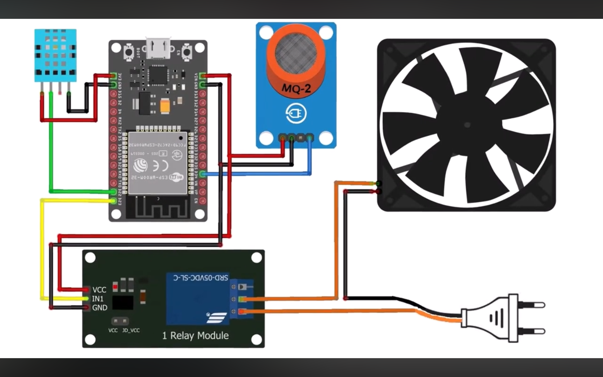
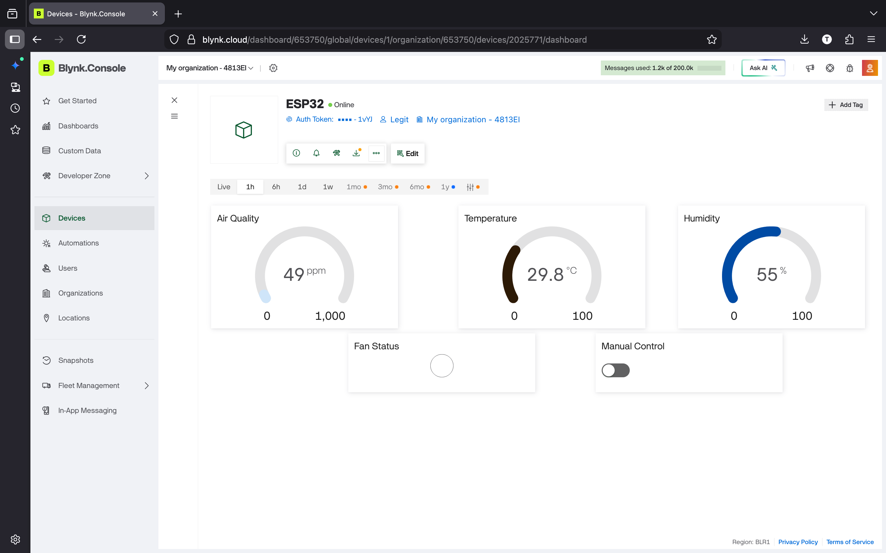

# 🌬️ IoT Smart Exhaust Fan (ESP32 Project)

## 📘 Overview

This project is an **IoT-enabled Smart Exhaust Fan** built using **ESP32**, **DHT11**, and **MQ135 sensors**.
It continuously monitors **temperature, humidity, and air quality** in real time and automatically activates the exhaust fan when environmental conditions exceed predefined thresholds.

The system can also be **remotely monitored and controlled using the Blynk IoT dashboard**.

> 🕒 Originally built as a **Semester 1 project** and later **refined and documented in Semester 4**.

This was my **first IoT project**, and seeing hardware and software interact in real time sparked my interest in **IoT, robotics, and embedded systems**.

---

# 🎯 Features

• Real-time **temperature and humidity monitoring**
• **Air quality monitoring** using MQ135 gas sensor
• **Automatic exhaust fan activation** when thresholds are exceeded
• **Manual fan control** through the Blynk IoT mobile app
• **Wi-Fi enabled system** powered by ESP32
• Uses **L298N motor driver instead of a relay module** for better fan control

---

# 🧰 Components Used

| Component          | Purpose                           |
| ------------------ | --------------------------------- |
| ESP32 DevKit V1    | Main microcontroller with WiFi    |
| DHT11 Sensor       | Measures temperature and humidity |
| MQ135 Gas Sensor   | Detects air quality and gases     |
| L298N Motor Driver | Drives the exhaust fan            |
| 12V DC Fan         | Ventilation system                |
| 12V Power Supply   | Powers the fan                    |
| Jumper Wires       | Electrical connections            |

---

# ⚙️ System Architecture

```
MQ135 Sensor  ----\
                   \
                    --> ESP32 --> L298N Motor Driver --> Exhaust Fan
                   /
DHT11 Sensor  ----/

             |
             |
          WiFi
             |
         Blynk App
```

The **ESP32 reads sensor values**, processes them, and controls the fan accordingly while communicating with the **Blynk IoT platform**.

---

# 🔌 Circuit Diagram

The complete circuit diagram is available below:



Detailed pin connections and wiring explanation can be found in:

```
docs/circuit_connections.txt
```

---

# 📱 Blynk IoT Dashboard

The system integrates with the **Blynk IoT mobile application** for remote monitoring and control.



Using the dashboard you can:

• Monitor sensor readings
• Turn the fan ON or OFF
• Track environmental conditions remotely

---

# 📷 Hardware Setup

### 🔧 Internal View


### 🧱 External View


---

# 🎥 Project Demonstration

A working demonstration video of the project is included in this repository.

Location:

```
videos/
```

You can download or view the demonstration directly from the GitHub repository.

---

# 💻 Source Code

The Arduino code used in this project can be found here:

```
codes/smart_exhaust_fan.ino
```

Upload the code to the ESP32 using **Arduino IDE**.

Required libraries:

```
Blynk
DHT Sensor Library
Adafruit Unified Sensor
```

---

# 🚀 Working Principle

1. The **DHT11 sensor** measures temperature and humidity.
2. The **MQ135 sensor** measures air quality and gas concentration.
3. ESP32 continuously monitors these sensor readings.
4. If air quality exceeds the predefined threshold, the system **activates the exhaust fan**.
5. The fan is driven using the **L298N motor driver powered by a 12V supply**.
6. Sensor data and fan control are accessible through the **Blynk IoT dashboard**.

---

# 📁 Repository Structure

```
iot-smart-exhaust-fan-esp32
│
├── codes
│   └── smart_exhaust_fan.ino
│
├── docs
│   ├── circuit_connections.txt
│   └── circuit_diagram.png
│
├── images
│   ├── blynk.png
│   ├── view_from_in.png
│   └── view_from_out.png
│
├── videos
│
├── LICENSE
└── README.md
```

---

# 📜 License

This project is released under the **MIT License**.

---

# 👨‍💻 Author
**Nisarg Vyas**
Computer Science Engineering Student
